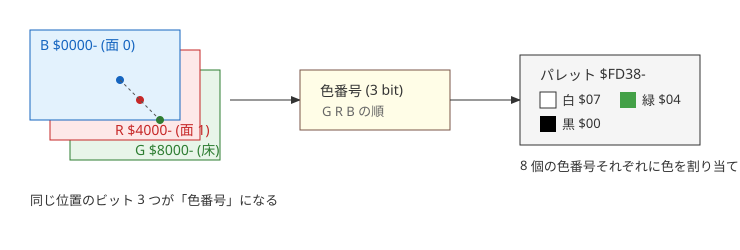
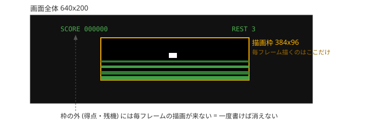
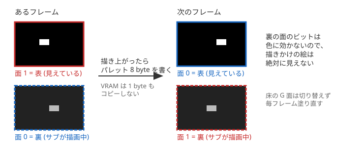
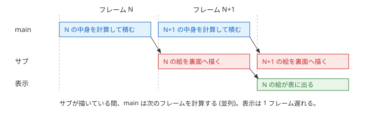
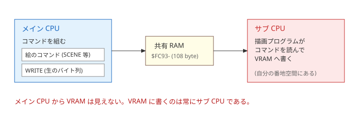

# HorizonRunner — 描画の仕組み

図と短い文で「何をやっているか」だけを書く。
番地や実装の入口は各図の下に添える。

## 1. 3 枚のプレーンと色

VRAM はサブ CPU 側にあり、B / R / G の 3 プレーンで 1 画面を成す。
同じ位置のビット 3 つが色番号になり、パレットが色を決める。



| プレーン | アドレス | 使い方 |
|---|---|---|
| B | `$0000-` | ダブルバッファリングの面 0。自機・自弾・敵 (白) |
| R | `$4000-` | ダブルバッファリングの面 1。同上 |
| G | `$8000-` | 床と地平線 (緑)。切り替えない |

## 2. 画面のどこに描くか

毎フレーム描くのは中央の描画枠 384x96 dot だけ。
得点・残機の文字は枠の外に置き、一度書いたら値が変わるまで書き直さない。



枠左上は line 52 / byte 16 (= B プレーンの `$1050`)。

## 3. ダブルバッファリング

B と R の 2 面を交互に使う。
裏の面へ描き切ってから、パレット 8 byte を書いて表裏を入れ替える。



パレットの 2 組は `src/asm_kbd.s` の `pal_b` / `pal_r`。
切替は `palette_page()` がこの 8 byte を `$FD38-` へ書くだけである。

入れ替えを回すのは `src/c_main.c` の `play()` の毎フレーム末尾 4 行。

```c
sub_sync();
palette_page((unsigned char)(1 - page));
sub_flush_async();
page = (unsigned char)(1 - page);
```

順に「前フレームの描き上がりを待つ → その面を表に出す → 今フレームぶんをサブへ投げる → 描く面を入れ替える」。
サブへは投げるだけで完了を待たないので、main とサブは並列に働く。



裏面に残る 2 フレーム前の絵は、サブが自分で消す。
描いた矩形を面ごとの表 (`LIST0` / `LIST1`) に控えておき、その面が次に選ばれた時に黒へ戻す (`src/asm_subprog.s` の `cmd_page`)。
main から消し込みの指示は送らない。

## 4. VRAM への書き込み

メイン CPU から VRAM は見えない。
main はコマンド列を共有 RAM に積むだけで、VRAM に書くのは常にサブ CPU である。



コマンドは 2 系統ある。

1. **絵のコマンド** — サブ側に置いてある絵や模様表を引いて描く。床と地平線 (`$04 SCENE`)、自機 (`$05 SPRITE`)、敵・自弾・爆発 (`$09 OBJS`) など。
2. **WRITE (`$0A`)** — 送られて来た生のバイト列を、指定番地へそのまま書く。メイン側にしか無いデータを VRAM へ置く時に使う。起動時の爆発の絵の転送と、文字 (字形はメイン側の `build/font.h`) の描画がこれ。

補足。
R / G プレーンの読み書きは VRAM ゲート (`$D409`) を開けて行う (描画プログラムが入口で開ける)。
ROM の TEST MOVE は VRAM を転送先に取れないので、起動時の絵の転送も WRITE で行う。
表示オフセットレジスタ (`$D40E/$D40F`) は常に 0 のまま使う。
